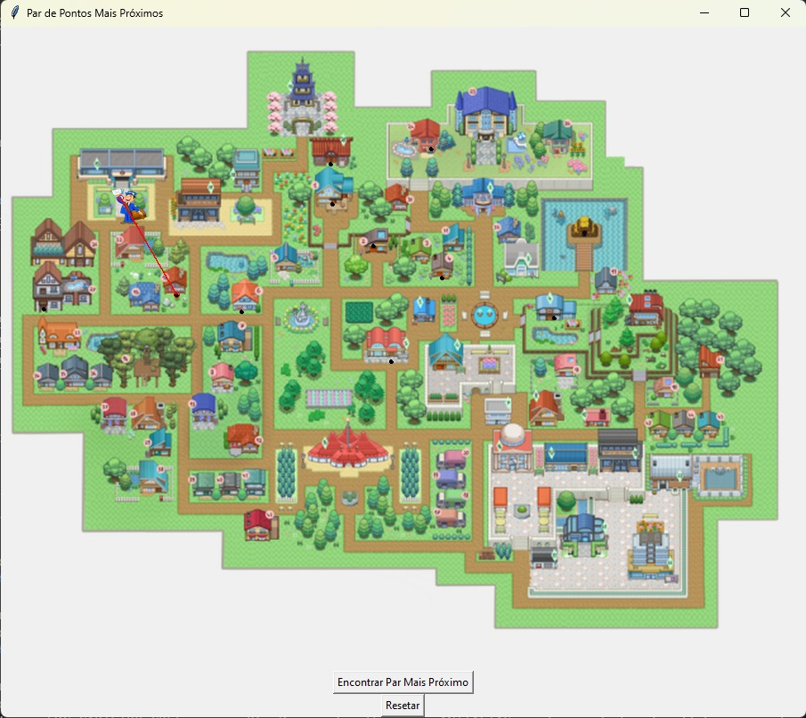

# DC_CARTEIRO_G25

**Número da Lista**: 25<br>
**Conteúdo da Disciplina**: Dividir e Conquistar

## Alunos
|Matrícula | Aluno |
| -- | -- |
| 19/0036435  |  Pedro Henrique Carvalho Campos |
| 20/0019520  |  Hian Praxedes de Souza Oliveira |

## Sobre 

Esse código é um exemplo de implementação do algoritmo de Par de Pontos Mais Próximos na utilização de localização de um carteiro no mapa da cidade.

Ao executar ele o usuário deve escolher o ponto inicial, que é a posição atual do carteiro no mapa da cidade, logo após isso todos os outros pontos que o usuário marcar serão os locais onde o carteiro vai entregar suas cartas.

Ao terminar as marcações o usuário deve apertar no botão "Encontrar Par mais Próximos", assim o programa irá mostar o ponto que forma o par mais próximo do carteiro.

Caso o usuário queira  refazer as marcações, basta apertar no botão "Resetar", assim o mapa é limpa para que seja marcado novamente.

### Vídeo de apresentação
[Apresentação](https://github.com/projeto-de-algoritmos/DC_CARTEIRO_G25/blob/main/video%20de%20apresentacao.mp4)

## Screenshots

<div align="center">
	
	
	
</div>

## Instalação 
**Linguagem**: Python<br>

O código utiliza os seguintes módulos, portanto, certifique-se de tê-los instalados em seu ambiente:

``` shell 
pip install tkinter
pip install pillow

``` 

## Uso 

Abra o arquivo do código em um editor de código como o VSCode, o Sublime Text, o PyCharm ou qualquer outro de sua preferência.

Execute o código com o comando:

``` shell 
python3 main.py
``` 

Aguarde até que a janela do programa esteja aberta e divirta-se.
